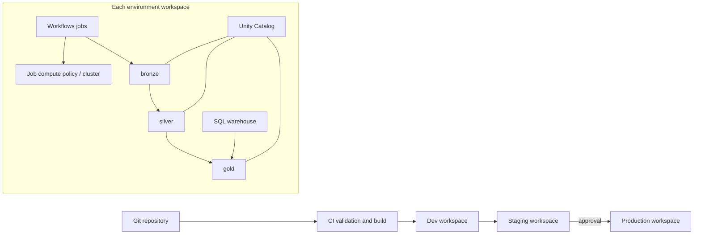

# Enterprise Databricks platform reference

This is a reference implementation for a multi-workspace Databricks lakehouse platform. It uses Databricks Asset Bundles (DAB) to define a repeatable release of jobs, compute, SQL warehouses, Unity Catalog schemas and grants. It illustrates dev → staging → prod promotion and a bronze → silver → gold pipeline.

## Architecture

Every environment is an isolated workspace deployment with its own catalog, secret references, identity, and data locations. Reusable code and resource definitions are promoted at the same Git commit; environment-specific values are supplied at deployment time. Dev, staging, and prod are separate DAB targets and are intended to point to separate workspace hosts.

## Resource coverage

| Resource | Management approach | Notes |
|---|---|---|
| Jobs / Workflows | Asset Bundle `resources/jobs.yml` | Service-principal run identity; medallion task dependencies |
| Clusters | Bundle job cluster; `resources/compute.yml` illustrates all-purpose cluster | Prefer job compute; enforce approved instance types with workspace policies |
| SQL warehouses | Bundle `resources/compute.yml` | Environment-sized, auto-stop; serverless availability depends on workspace/cloud |
| Catalogs / schemas | Catalog is pre-provisioned; bundle defines schemas | Catalog storage roots and metastore attachment vary by cloud/account |
| Grants | Bundle `resources/permissions.yml` | Use groups, least privilege, and separate production approvers |
| Secrets | External secret manager + workspace secret scope | Bundle contains scope/key references only, never values |
| Bronze / silver / gold | Unity Catalog schemas plus example Spark transforms | Production pipeline should use Delta Live Tables / Lakeflow Declarative Pipelines where appropriate |

## Deploy and promote

1. Configure one workspace host and workload identity per environment in CI secrets/variables. Bootstrap Unity Catalog, external locations, secret scopes, workspace groups, and policies through Terraform/account-level provisioning.
2. Run bundle validation and Python packaging checks on every pull request. Deploy dev automatically from the feature branch.
3. Run integration and data-quality checks in dev, then deploy the same commit to staging and execute representative workloads.
4. Require human approval and a protected release tag/branch before production deployment. Never rebuild a different artifact between stages.
5. Observe job outcomes, freshness, data quality, cost, and audit events. Roll back by redeploying the previous Git release; data rollback uses Delta time travel/restore with an explicit retention policy.

The configuration uses one target per environment. If an environment has several workspaces (for example, separate engineering and analytics workspaces), create one target per workspace and share the catalog/metastore deliberately. Do not allow the same bundle deployment to create conflicting copies of singleton resources.

## Local setup

- Install a current Databricks CLI with Asset Bundles support.
- Authenticate separately to each target workspace using service-principal OAuth in CI.
- Set `DATABRICKS_HOST`, `DATABRICKS_CLIENT_ID`, and target-specific values; see `docs/deployment.md`.
- Run `databricks bundle validate -t dev`, then `databricks bundle deploy -t dev`.

This is a reference scaffold, not a cloud-ready turnkey deployment: cloud-specific identity, network, storage, metastore, account groups, policy IDs, and secret-manager integration must be supplied for the actual tenant.
